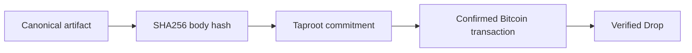
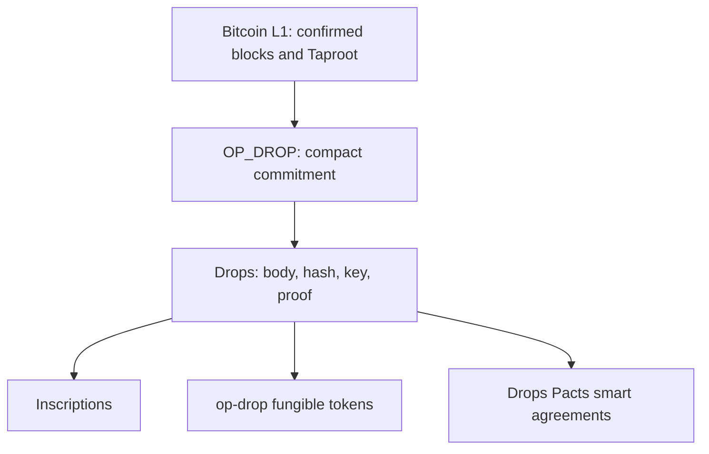

# Drops

**A clear, verifiable artifact layer for Bitcoin.**

Drops gives people and applications a compact way to give a record a permanent home on Bitcoin through `OP_DROP`. In plain language: publish something clear, let Bitcoin confirm it, and let anyone check the same proof later. Every Drop has one canonical envelope, an explicit Taproot anchor, a deterministic identity, and a proof that any independent indexer can check.

Start with the [Drops documentation landing page](https://bitcoinuniverse.github.io/drops-docs/). It is designed for people using Drops, teams integrating it, and operators running verification.

## Bitcoin L1, with a clear product surface

Drops is built directly on Bitcoin's confirmed transaction history. A confirmed artifact is an immutable on-chain commitment, not a mutable database entry. The exact body remains tied to its hash, canonical `OP_DROP` leaf, and Taproot proof so any compatible verifier can check the same fact independently.

| Build with Drops for | What stays visible on Bitcoin | Why it matters |
| --- | --- | --- |
| **Drops inscriptions** | Compact artifact body, creator key, canonical ID, and proof | A clear identity-rich record without sat-number assignment rules. |
| **op-drop fungible tokens** | Strict token events, beginning with [`$DROP`, the first token on op-drop](https://inscribe.bitcoinuniverse.io/?tab=op_drop), and their confirmed carrier proof | Token rules remain separate from generic artifact parsing. |
| **Drops Pacts smart agreements** | Agreement identity, current Cell, state transitions, and Proof Packs | Contract-style Bitcoin flows remain inspectable without an opaque VM. |

### OP_DROP native and BIP-110 ready

Drops uses one canonical `OP_DROP` leaf grammar. It also recognizes the registered `bip110-op-drop` compatibility carrier through its own strict decoder, so applications can support both formats without treating them as interchangeable. This separation keeps generic artifacts, token events, and Pact records easy to reason about.

## Choose your path

- **I want to understand Drops:** read the [protocol overview](pages/drops-specification.html) and [why Drops is designed differently](pages/why-drops.html).
- **I want to create or verify a Drop:** follow the [verifier guide](pages/verifier-guide.html).
- **I want to build an app:** use the [Drops API reference](pages/verifier-guide.html#configure-inscribe), then review the [carrier registry](pages/carrier-registry.html).
- **I want to explore Pacts:** begin with [Drops Pacts](pages/pacts-reference.html), then the [Pacts Studio guide](pages/pacts-studio-guide.html).

## Why Drops

Drops is built for applications that want Bitcoin artifacts to be easy to read, easy to verify, and hard to misinterpret.

| What you get | Why it matters |
| --- | --- |
| One canonical carrier | The marker, MIME type, body hash, body, and creator key always appear in the same order. |
| Proof before display | A verified indexer proves the exact Taproot leaf against the spent P2TR output before recording a Drop. |
| Stable identity | `drops:<network>:<reveal-txid>:d<input-index>` identifies the artifact without relying on a satoshi numbering convention. |
| Small, legible bodies | A native body is capped at 256 bytes, encouraging meaningful records instead of ambiguous payload conventions. |
| Wallet and indexer freedom | Anyone can run a verifier, inspect the proof, or build a compatible wallet flow. |

Drops does not ask users to trust a database just because it has observed a transaction. The artifact body, its hash, its carrier, and its Bitcoin anchor must agree.

## What you can do today

- Publish a compact text, JSON, identifier, checksum, manifest pointer, or other bounded artifact.
- Verify a confirmed Drop with the Drops CLI and your own Bitcoin Core connection.
- Search confirmed artifacts by canonical Drop ID, body hash, or Pacts Studio plan hash.
- Build a backend integration against the read-only [OpenAPI and Swagger interface](pages/verifier-guide.html#configure-inscribe).
- Design a bounded Pact agreement in Pacts Studio and record its plan and blueprint hashes as a Drop.

## What a Drop proves

A confirmed Drop proves that a particular set of bytes was committed in a canonical `OP_DROP` leaf and that the leaf committed to the spent Taproot output. It does not by itself prove authorship outside the committed public key, legal rights, token balances, live contract execution, or custody.

That clear boundary is intentional. It keeps the protocol useful without asking users to accept hidden rules.

## Protocol map

- [Drops wire specification](pages/drops-specification.html)
- [Carrier registry](pages/carrier-registry.html)
- [Drops Pacts](pages/pacts-reference.html)
- [Pacts Studio artifact profile](pages/pacts-artifact.html)

## Naming

The protocol is **Drops**. One artifact is **a Drop**. The command-line tool is `drops`. The canonical record identity is always `drops:<network>:<reveal-txid>:d<input-index>`.

Before a public brand launch, complete normal trademark, domain, package-registry, and social-handle review for the intended jurisdictions.
