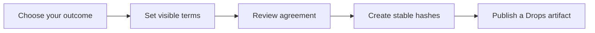
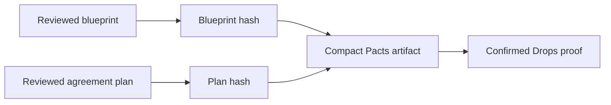

# Pacts Studio

Pacts Studio turns a plain-language agreement into a clear Bitcoin artifact that people can read, review, and preserve. It lives in the Drops area of the app and guides you through a bounded agreement without asking you to learn a contract language first.


## From an idea to an immutable Bitcoin record

Pacts Studio is the human-friendly path into Bitcoin L1 agreements. You choose a familiar outcome, set the visible terms, and review the result before your wallet records the completed hash pair as a Drops artifact. The agreement you publish is tied to a canonical `OP_DROP` commitment and Taproot proof, not a mutable project page or a hidden application database.

For compatible token flows, Studio keeps the reviewed op-drop values alongside the agreement. `$DROP`, the first token on op-drop, uses this clear fair-launch path with a public fixed supply and mint limit. For Drops Pacts, Studio gives the agreement a durable starting record that wallets, explorers, and independent verifiers can rediscover from Bitcoin history.



## Start a Pact

1. Open **Drops** and select **Build a Pact**.
2. Choose the agreement that matches your goal.
3. Fill in the visible terms. Use public Bitcoin addresses or public keys for controllers, beneficiaries, and recovery destinations.
4. Read the generated PactScript and the plain-language clauses together.
5. Review the stable hashes, then export the blueprint or publish the completed agreement artifact.

## Choose a clear starting point

| Your goal | What you set in Studio | What the completed artifact preserves |
| --- | --- | --- |
| Fair launch | Ticker, supply, mint limit, and participant terms | The reviewed launch terms and op-drop payload binding |
| Shared treasury | Controllers, thresholds, recovery path, and policy | The people who control the treasury and its visible rules |
| Vesting | Beneficiaries, amounts, and block-height schedule | A compact record of the release terms everyone reviewed |
| Escrow | Depositor, recipient, release condition, and refund path | The condition that governs release and the fallback route |
| Drop rights | Asset reference, holders, and permitted actions | The exact policy terms that relate to the Drop |

## What you receive

- **Readable clauses:** an agreement summary written for the people who will use it.
- **PactScript:** a compact, Solidity-style expression of the selected terms.
- **Blueprint:** deterministic JSON that preserves the agreement in a stable form.
- **Blueprint hash:** a SHA256 fingerprint of the exact blueprint.
- **Plan hash:** a SHA256 fingerprint of the full reviewed package, including the PactScript and any linked canonical op-drop launch payload.
- **Drops reference:** a compact Bitcoin artifact that records the completed hash pair for independent discovery.

The hashes make review practical. If the terms change, the hash changes. Anyone can compare the displayed hash with the artifact they receive.

## Review with confidence

Before you publish or sign, Pacts Studio puts the important facts in one review surface:

1. **People and keys:** public controllers, beneficiaries, and recovery destinations.
2. **Terms and limits:** every amount, schedule, threshold, and allowed action.
3. **Plain language and PactScript:** two views of the same selected template.
4. **Stable hashes:** the fingerprints that change when any reviewed detail changes.
5. **Bitcoin record:** the compact Drops artifact that preserves the completed hash pair.

## Publish an agreement reference

When the visible checks are complete, Pacts Studio creates this canonical Drops body:

```json
{"bh":"<blueprint-hash>","p":"pacts","ph":"<plan-hash>","t":"fair-launch"}
```

The body uses `application/vnd.drops.pacts-reference+json` and stays within the 256-byte Drops body limit. Once it is committed in a verified Drop, an indexer can find it by exact plan hash.

Use the [Pacts Studio artifact profile](../pages/pacts-artifact.html) for the full canonical rules.



## Launch an op-drop token

The fair-launch template checks the token values before it hands the reviewed deployment into the existing op-drop launch flow.

- The ticker uses four lowercase ASCII letters or digits.
- Maximum supply and mint limit are positive integers.
- Mint limit is no greater than total supply.
- [`$DROP` uses the fixed terms of `21,000,000` maximum supply and `1,000` per mint.](https://inscribe.bitcoinuniverse.io/?tab=op_drop)

The app compares the final token payload to the reviewed payload before it creates the order. If any term changes, return to Pacts Studio, review the updated agreement, and create a new hash pair.

## Your wallet stays in control

Pacts Studio creates clear artifacts and review material. Your Taproot-capable wallet constructs, reviews, signs, and broadcasts Bitcoin transactions. Private keys, seed phrases, and signing material remain in the wallet.

## Pact Copilot

Pact Copilot can turn a short description into a bounded starting template. It requires your consent before a request is sent and rejects secret material such as seed phrases, private keys, wallet exports, `xprv`, and `tprv`.

Copilot helps you phrase and organize terms. You remain in control of the final agreement and its Bitcoin transaction.

## A final check before publishing

- Confirm that every address and public key belongs to the intended party.
- Confirm that amounts, mint limits, dates, and block-height conditions match the terms you agreed.
- Read the plain-language clauses and PactScript together.
- Compare the displayed blueprint and plan hashes with the values you save or share.
- Publish only through a wallet screen that shows the Bitcoin transaction you are approving.

## Blueprint format

```json
{
  "format": "pacts-studio-blueprint",
  "status": "final",
  "execution": "verified",
  "network": "bitcoin",
  "template": "fair-launch",
  "asset": {
    "protocol": "op-drop",
    "ticker": "glow",
    "binding": "unbound-ticker-reference"
  }
}
```

`status`, `execution`, and `network` describe the blueprint itself. The published Drops reference records the exact `blueprintHash`, `planHash`, and template identifier.
