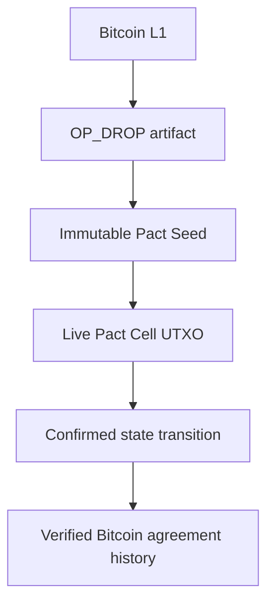

# Drops Pacts

**Drops Pacts** is the agreement layer for Drops. It gives a Bitcoin agreement a stable identity, a visible current state, and a proof package that every party can inspect. A Pact is not an opaque virtual machine. It is a bounded agreement whose terms, lifecycle, and verification path remain understandable from the first review through every confirmed update.


## Smart agreements on Bitcoin L1

Pacts brings smart-contract-style coordination to Bitcoin L1 without asking users to leave Bitcoin for a separate execution network. The immutable Pact Seed is recorded as a Drops artifact. The live Pact Cell is a Bitcoin UTXO. Each accepted update is a confirmed Bitcoin transaction with a compact proof trail.

That creates a simple promise for every party: the agreement identity stays fixed, the current state stays visible, and every verified change can be followed on Bitcoin. Completed Pacts Studio artifacts can use the canonical Drops carrier or the registered `bip110-op-drop` compatibility carrier, each with strict parsing rules and its own unambiguous meaning.



## Start with what matters to you

| If you need to | Pacts gives you | What you can inspect |
| --- | --- | --- |
| Share custody | A named Pact with declared controllers and recovery terms | The Pact ID, current Cell, policy root, and confirmed state history |
| Hold value in escrow | Terms for release, refund, and the next allowed state | The visible agreement, state transition, and Proof Pack |
| Release value over time | A schedule tied to Bitcoin block height | The beneficiary, schedule terms, current sequence, and successor state |
| Attach a policy to an op-drop asset | A compact agreement record alongside the asset policy | The reviewed hash pair and linked Drops artifact |

Open [Pacts Studio](../pages/pacts-studio-guide.html) to choose a bounded agreement, review the visible terms, and record the completed artifact on Bitcoin.

## The Pact journey


A **Pact Cell** is the central object in this journey. It is a P2TR UTXO that commits to the agreement identity and current state. A normal state update consumes one Cell, creates its successor, and publishes a compact transaction commitment. A verifier can inspect that one transition, its Proof Pack, and its successor Cell without replaying arbitrary bytecode from the beginning of the protocol.

Pacts supports custody, escrow, treasuries, vesting, bounded auctions, rights, and op-drop policy controls. It uses bounded agreement rules rather than a general-purpose EVM or WASM environment.

Bitcoin validates UTXO spends, signatures, timelocks, and transaction structure. Pact validators interpret the agreement rules. If a Cell is spent outside the Pact flow, the Pact closes instead of silently moving its state to a new Cell. The displayed enforcement grade tells each signer exactly which conditions Bitcoin enforces and which conditions are checked by Pact validation.

## Before you sign

Review these facts in the wallet or explorer before approving a Pact transaction:

1. **Pact ID:** the stable identity of the agreement you are joining.
2. **Current Cell:** the exact UTXO and sequence being updated.
3. **Visible terms:** controllers, beneficiaries, release conditions, recovery terms, and any asset policy.
4. **Next state:** the successor Cell, its state root, and its policy root.
5. **Proof status:** whether the matching Proof Pack verifies against the confirmed Bitcoin transaction.

Wallet signing remains in the wallet. Private keys, seed phrases, and signing material never enter Drops or Pacts tools.

## Terms

| Term | Meaning |
| --- | --- |
| Pact Seed | An immutable Drops artifact that commits to a Pact's engine, ruleset, ABI, initial state, policy, and data-availability policy. |
| Pact ID | The stable 32-byte identifier derived from the network, Seed Drop ID, ruleset hash, ABI hash, and policy root. |
| Pact Cell | The live P2TR UTXO carrying a Pact's current state commitment. |
| Cell descriptor | The fixed binary object committed in a hidden, deliberately unspendable Taproot leaf. |
| Transition | A confirmed transaction that consumes a current Cell and creates its successor. |
| Proof Pack | Hash-addressed canonical data that proves the semantic transition and the successor Cell commitment. |
| Enforcement grade | The exact boundary between Bitcoin Script enforcement and Pact-validator interpretation. |

## Pact Seed

A Seed is a new registered carrier, `drops-pact`. It is not a reinterpretation of `drops` or `bip110-op-drop`. Its body is a compact canonical record that commits to the following hashes:

```text
engine_id
ruleset_hash
abi_hash
genesis_state_root
policy_root
data_availability_policy_hash
enforcement_floor
```

The seed contains hashes and concise identifiers only. Source code, human-readable ABI, audit reports, and large fixtures are external content addressed by those hashes. A Pact ID is:

```text
TaggedHash("Drops/Pact",
  network_tag || seed_drop_id || ruleset_hash || abi_hash || policy_root)
```

Each Pact permanently fixes its engine and ruleset. A new engine is a new Pact. No global height switch may retroactively change an existing Pact's meaning.

### Seed record

The Pacts codec uses an exact 184-byte binary Seed body with MIME type `application/vnd.drops.pact-seed` and marker `drops-pact`:

| Offset | Size | Field |
| ---: | ---: | --- |
| 0 | 4 | ASCII `DPSE` |
| 4 | 1 | Reserved, zero |
| 5 | 1 | Network tag, mainnet `0`, testnet `1`, signet `2`, regtest `3` |
| 6 | 1 | Enforcement floor, Recorded `0`, Co-signed `1`, Template-enforced `2` |
| 7 | 1 | Reserved, zero |
| 8 | 16 | Lowercase ASCII engine ID, zero padded |
| 24 | 32 | Ruleset hash |
| 56 | 32 | ABI hash |
| 88 | 32 | Genesis state root |
| 120 | 32 | Policy root |
| 152 | 32 | Data-availability policy hash |

For the Pact ID calculation, the canonical Seed Drop ID is parsed as `drops:<network>:<reveal-txid>:d<input-index>` and encoded as its little-endian reveal txid plus a big-endian uint32 input index. This fixes the Seed Drop ID byte representation before any multi-language implementation is released.

## Pact Cell

A Cell is an ordinary P2TR output. The normal update route is the key path, controlled by one key or a MuSig2 aggregate key. The output's script tree must contain a descriptor leaf. The descriptor leaf is deliberately unspendable and serves only as a verifiable commitment to the Cell data.

```text
PUSH "drops-cell" OP_DROP
PUSH <176-byte Cell descriptor> OP_DROP
OP_0
```

The descriptor leaf always evaluates false. It must never be presented as a valid spend path. A validator receives its leaf and control block inside the hash-checked Proof Pack, then recomputes the P2TR output key. This makes the next state independently auditable even though normal updates use the private key path.

### Cell descriptor

All integers are unsigned big-endian. Reserved bytes must be zero. The descriptor is exactly 176 bytes.

| Offset | Size | Field |
| ---: | ---: | --- |
| 0 | 4 | ASCII `DPCL` |
| 4 | 1 | Reserved, zero |
| 5 | 1 | Flags |
| 6 | 2 | Reserved, all zero |
| 8 | 32 | Pact ID |
| 40 | 8 | Cell sequence |
| 48 | 32 | State root |
| 80 | 32 | Policy root |
| 112 | 32 | State attachment hash, or all zero |
| 144 | 32 | Transition commitment that created this Cell, or all zero for genesis |

The Cell descriptor itself uses only data pushes smaller than 256 bytes. Optional recovery leaves are declared in the Seed policy and remain visible to the parties reviewing the agreement.

## Transition commitment

Normal Pacts updates use a 64-byte key-path Schnorr signature with no sighash suffix, meaning `SIGHASH_DEFAULT`. This commits the current Cell controller to all transaction inputs and outputs, including the successor Cell and the discovery output below. A validator rejects `SIGHASH_NONE`, `SIGHASH_SINGLE`, `ANYONECANPAY`, annexes, and script-path spends for a normal transition.

The transaction contains exactly one discovery output for the transition:

```text
OP_RETURN PUSH("DPC1" || transition_commitment)
```

The script is 38 bytes: `OP_RETURN`, one direct-push opcode, four ASCII bytes, and the 32-byte commitment.

The commitment is a tagged hash over a fixed 245-byte preimage:

```text
transition_commitment = TaggedHash("Drops/PactTransition",
  network_tag             // 1 byte
  || pact_id              // 32 bytes
  || parent_outpoint      // txid little-endian + vout, 36 bytes
  || parent_input_index   // uint32
  || successor_output     // uint32
  || parent_sequence      // uint64
  || parent_state_root    // 32 bytes
  || next_state_root      // 32 bytes
  || next_policy_root     // 32 bytes
  || proof_pack_hash      // 32 bytes
  || op_drop_effect_hash) // 32 bytes, all zero when absent
```

The successor output index is explicit. The referenced output must be a P2TR Cell whose descriptor proves the matching Pact ID, sequence, state root, policy root, and transition commitment.

Pacts uses one normal parent Cell and one successor Cell per transaction. This keeps each signed update compact, inspectable, and easy to verify.

## Proof Pack

The Proof Pack is canonical CBOR. It is not authority. Anyone may host the exact same bytes, and a missing pack is never a valid transition.

The transition preimage cannot hash the entire Proof Pack because the Proof Pack contains that preimage and the successor descriptor contains the resulting transition commitment. That would be a circular, unconstructible commitment. Pacts therefore defines `proof_pack_hash` as the SHA256 hash of the canonical **Proof Pack payload** only. The payload is the canonical CBOR map with numeric keys 8 through 13: ruleset input, state witnesses, state delta, 32-byte ruleset result, optional op-drop effect bytes, and availability hashes. The full Proof Pack includes fields 1 through 13 and is separately canonicalized and validated against the transition, Cell descriptors, descriptor leaf, control block, and successor output.

A valid Proof Pack contains:

1. The fixed transition preimage and its commitment.
2. The parent Cell descriptor and its previously verified lineage reference.
3. The successor Cell descriptor, descriptor leaf, and control block.
4. The exact successor output script and output index.
5. The action input, state witnesses, state delta, and deterministic ruleset result.
6. The optional op-drop effect record whose hash is committed above.
7. A data-availability manifest with content hashes only, not trusted URLs.

The Pacts encoder accepts definite-length CBOR only, shortest integer encodings, no floating point values, no duplicate map keys, numeric map keys in ascending order, a maximum depth of 32, and at most 16 availability hashes. It rejects non-canonical equivalents before hash comparison.

Canonical CBOR rules are fixed before implementation: definite lengths only, shortest integer encoding, no floating-point values, no duplicate map keys, numeric keys in ascending order, and no application-defined normalization. See [RFC 8949](https://www.rfc-editor.org/rfc/rfc8949.html) for deterministic CBOR guidance.

Clients may fetch packs from any relay, local archive, or bundled test fixture. The hash is the integrity boundary. A public pact indexer must expose `committed-unavailable` distinctly from `pact-verified`.

## Rulesets

Pacts uses audited, declarative rulesets. It does not execute arbitrary WASM. A ruleset is allowed only when it has a frozen hash, a typed schema, a bounded execution profile, and independent test vectors.

The included ruleset families are:

1. Two-party escrow with CSV refund.
2. MuSig2 treasury with a declared emergency recovery path.
3. Block-height vesting and release schedule.
4. Fixed-price sale or bounded auction.
5. op-drop supply and transfer policy.
6. Oracle-attested settlement behind an explicit oracle enforcement grade.

Every ruleset uses checked integer arithmetic, fixed units, no floating point, no host network access, no wall-clock input, no hidden global state, and explicit block-height input only.

## State lifecycle

1. A Seed is confirmed and its Pact ID is derived.
2. A genesis Cell is created and its descriptor proof is published in a Proof Pack.
3. A normal transition key-path spends that Cell using `SIGHASH_DEFAULT`, creates a successor Cell, and emits a `DPC1` commitment output.
4. The validator retrieves the matching Proof Pack, verifies both Cell commitments, replays the bounded ruleset, and marks the successor `pact-verified` only on success.
5. A best-chain reorganization rolls state back by block hash, not only by height.
6. A Cell spent without a valid matching transition is `closed`. Its state cannot silently move to a new Cell.

## Bitcoin enforcement boundary

Bitcoin consensus enforces that a valid Cell can only be spent once and that its key-path or recovery-script conditions are met. It does not execute the Pact ruleset or force arbitrary successor state. The `Pact-verified` conclusion is an independent protocol validation result.

This distinction is a product feature. Wallets and explorers must display the enforcement grade before a user signs or accepts an asset.

## Related Bitcoin primitives

The design relies on deployed Taproot and Tapscript semantics from [BIP-341](https://github.com/bitcoin/bips/blob/master/bip-0341.mediawiki) and [BIP-342](https://github.com/bitcoin/bips/blob/master/bip-0342.mediawiki). Recovery templates can use `OP_CHECKSIGADD`, `OP_CHECKLOCKTIMEVERIFY`, and `OP_CHECKSEQUENCEVERIFY` where the selected enforcement grade requires them. MuSig2 is an optional key aggregation mechanism specified in [BIP-327](https://github.com/bitcoin/bips/blob/master/bip-0327.mediawiki).
